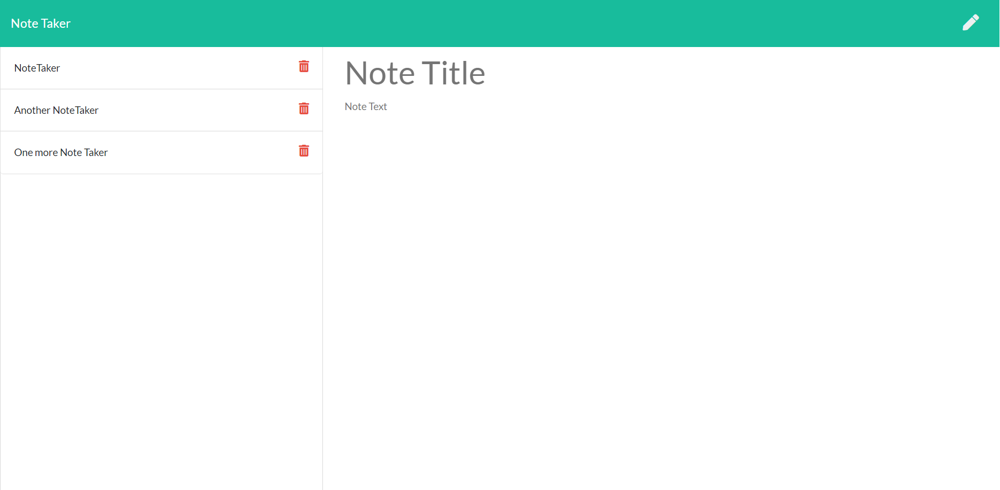

# Note Take Express

## Description

To create an application called Note Taker that can be used to write and save notes. This application uses an Express.js back end and will save and retrieve note data from a JSON file. The UUID package is used to attach a unique id to each note.

## Table of contents

- [Installation](#installation)
- [Usage](#usage)
- [Credit](#credit)
- [Tests](#tests)
- [GitHub](#github)
- [Email](#email)
- [Questions](#questions)
- [License](#license)

## Installation

The following dependencies are need to run this code:

```
npm i
```

```
npm i uuid
```

```
npm i path
```

```
npm i express
```

## Usage

The following command will run the application with:

```
node server
```




Alternatively the application can be deployed using Heroku

<hr>

## Credit

Jelani Thomas

## Tests

None

## GitHub

[GeloneJT](https://github.com/GeloneJT)

## Email

jelani13@icloud.com

## Questions

Contact me via email or GitHub for questions about this repository or any others I've worked on.

## License

[](https://opensource.org/licenses/MIT)
